# Setting up a locked-down data ingestion project

Whether you are exchanging data with a research partner, archiving or replicating your data in cloud, or building your next generation analytics and machine learning platform on [Google Cloud](https://cloud.google.com), at some point you'll ingest some data into [Google Cloud Storage (GCS)](https://cloud.google.com/storage/). If there is any chance of your data containing [Personally Identifiable Information (PII)](https://en.wikipedia.org/wiki/Personally_identifiable_information) or [Protected Health Information (PHI)](https://en.wikipedia.org/wiki/Protected_health_information), you'll have to apply extra measures in protecting the data. This tutorial walks you through the process of creating a [project](https://cloud.google.com/resource-manager/docs/cloud-platform-resource-hierarchy#projects) and setting it up to ingest sensitive data into a [Cloud Storage bucket](https://cloud.google.com/storage/docs/key-terms#buckets). 

>:point_right: **Note**: Whether you intent to ingest raw data containing PHI/PII or de-identified data, you should treat the storage bucket as if it contains PHI/PII. You'll be happy you did so when and if there are accidental PHI/PII leakage in an otherwise de-identified dataset.

While this tutorial is by no means a complete guide to [data privacy in Google Cloud](https://cloud.google.com/security/privacy/), it emphasizes some best practices and helps you automatically enforce them: 
- Set up access to resources using a [defined set of groups](#defined-groups)
- Maintain required audit logs
- Monitor malicious activities that could alter resource access policies
- Be alert about people/bots outside of your whitelisted user list accessing your data

The tutorial is written as a Python script encapsulating a number of command line API calls. It consists of the following major steps:

- [Step 1](#step-1-create-a-gcp-project): Create a GCP project
- [Step 2](#step-2-setup-access-to-the-project): Set up access to the project
- [Step 3](#step-3-setup-a-gcs-bucket-for-storing-logs): Set up a Cloud Storage bucket for storing logs
- [Step 4](#step-4-setup-the-main-gcs-bucket): Set up the main Cloud Storage bucket for storing the data
- [Step 5](#step-5-setup-audit-logging-and-monitoring): Set up audit logging and monitoring


## Disclaimer
- This tutorial is intended to provide technical advice on how to implement data protection steps against a Cloud Storage bucket. It does NOT constitute legal advice on what protections are required to comply with any data privacy legislation.
- The scope of this tutorial is limited to protecting/monitoring data stored in one Storage bucket (i.e. `DATA_BUCKET_ID` as specified in `parameters.py`). It doesn't automatically cover derivative data assets stored in GCP
(i.e. other Storage buckets, [Google BigQuery (BQ)](https://cloud.google.com/bigquery/), [Cloud Dataproc](https://cloud.google.com/dataproc/) persistent disk, [Google Compute Engine](https://cloud.google.com/compute/) persistent disk, etc.).
You must apply similar measures against derivative data assets.
- The code has been tested on Python 2.7. If you are using a different version of Python, you may face syntax errors which you will have to fix on your own.
- This is not an official Google product.


## Best practices
1. Apply [Principle of Least Privilege](https://en.wikipedia.org/wiki/Principle_of_least_privilege)
2. Control who can alter [Identity and Access Management (IAM) policies](https://cloud.google.com/iam/docs/overview)
3. Use groups, not individual users, to manage permissions
4. Regularly audit activity logs
5. Be alert about [offensive activities](#offensive-activities)
6. Rotate service account keys (out of scope)
</br>
</br>

>:point_right: **Note**: [Managing service account keys](https://cloud.google.com/iam/docs/understanding-service-accounts#managing_service_account_keys) is beyond the scope of this tutorial.


## Offensive activities
Any of the following actions is considered offensive in this context:
1. Altering IAM policies at the project level
2. Altering permissions against the data bucket
3. Altering permissions against the individual objects in the data bucket 
4. Anyone other than the users named in `WHITELIST_USERS`, specified in `parameters.py`, accessing the data bucket

## Defined groups
The script uses five groups which are listed in the below table. Groups are named according to naming convention: `[PROJECT_ID]-[ROLE]@[DOMAIN]`. For example, for `PROJECT_ID="my-sample-locked-down-project"` and `DOMAIN="google.com"`, `OWNERS_GROUP` would resolve to `my-sample-locked-down-project-owners@google.com`.
The table summarizes roles assigned to each group. Refer to [Project IAM roles](https://cloud.google.com/resource-manager/docs/access-control-proj), [Cloud Storage IAM roles](https://cloud.google.com/storage/docs/access-control/iam-roles) and [BQ Access Control](https://cloud.google.com/bigquery/docs/access-control) for details on the listed IAM roles.
<br/><br/>
The last column highlights the group that will receive notifications when [offensive activities](#offensive-activities) are detected in the audit logs.
<br/><br/>

.                   | project    | log bucket           | data bucket          | logs in BQ | notifications
------------------- | ---------- | -------------------- | -------------------- | ---------- | -------------
`LOG_READER_GROUP`  | -          |`storage.objectViewer`| -                    | `READER`   | -
`OWNERS_GROUP`      |`OWNER`     |`storage.admin`       |`storage.admin`       | `OWNER`    | -
`AUDITORS_GROUP`    | -          |`storage.admin`       | -                    | `OWNER`    |:white_check_mark:
`DATA_READER_GROUP` | -          | -                    |`storage.objectViewer`| -          | -
`DATA_CREATOR_GROUP`| -          | -                    |`storage.objectAdmin` | -          | -


## Before you begin
1. Ensure you have a [Stackdriver account](https://cloud.google.com/monitoring/accounts/). Refer to the [Stackdriver guide](https://cloud.google.com/monitoring/accounts/guide) for further details.
2. Review `parameters.py` and adjust any parameter marked with `"CHANGE ME!"` comment.
3. Install or upgrade [Google Cloud SDK](https://cloud.google.com/sdk/install).
4. Authenticate with `gcloud` using the following command:
```
    gcloud auth login
```

5. Ensure [required user groups](#defined-groups) exist and you are a member of `OWNERS_GROUP`.


## Running the script

    python project_setup.py


The script is designed to run a sequence of command line operations without requiring any user input. If the [prerequisites](#before-you-begin) are in place, it should finish in 5 -10 minutes.
</br></br>By default, the script prints all the commands before executing them followed by the resulting messages. These console messages should come handy in error situations. In a happy day scenario, you can ignore the messages on the console or even turned them off.
If you prefer to run the script quietly, you can set `chatty=False` in `run_command()` in `utils.py`.


## Understanding the script
By examining `project_setup.py`, you will notice the script invokes 5 functions which map to five steps explained in great details below.

### Step 1: Create a GCP project
By running `create_project()` function, you:
- create a [gcloud config](https://cloud.google.com/sdk/gcloud/reference/config/configurations/)
- create the project and map it to the billing account and organization
- set the project as the default in the gcloud config

##### Executed commands
```
gcloud config configurations create [CONFIG_NAME] --activate

gcloud config set account [ACCOUNT]

gcloud projects create --organization=[ORGANIZATION_ID] [PROJECT_ID]

gcloud projects describe [PROJECT_ID]

gcloud beta billing projects link --billing-account [BILLING_ACCOUNT] [PROJECT_ID]

gcloud config set project [PROJECT_ID]

gcloud config configurations list
```

##### Expected result(s)

The newly created project is available on [GCP console](http://console.cloud.google.com/).


### Step 2: Set up access to the project
By running `set_project_access()` function, you:
 - adjust project rights by making `OWNERS_GROUP` an owner of the project
 - remove all other IAM policy bindings against the project, including your own direct access
</br>
</br>

>:point_right: **Note**: Ensure `ACCOUNT` is a member, directly or indirectly, of `OWNERS_GROUP` before running this step!!!
>`ACCOUNT` and `OWNER_GROUP` are specified in `parameters.py`.

##### Executed commands
```
gcloud projects add-iam-policy-binding [PROJECT_ID] --member="group:[OWNERS_GROUP]" --role="roles/owner"

gcloud projects remove-iam-policy-binding [PROJECT_ID] --member="[MEMBER]" --role="[ROLE]"
```

##### Expected result(s)

[IAM console](http://console.cloud.google.com/iam-admin/iam) shows `OWNERS_GROUP` (specified in `parameters.py`) as the one and only identity with project level role.

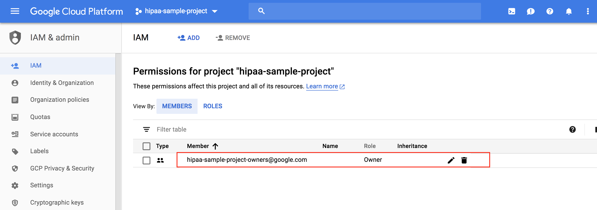

### Step 3: Set up a Cloud Storage bucket for storing logs
By running `create_logs_bucket()` function, you:
- create a Cloud Storage bucket for storing logs
- set/overwrite access rights according to [best practices](#best-practices)
- define a life cycle to purge aging logs
</br>
</br>

>:point_right: **Note**: The logs in this bucket are considered supplemental to [Cloud Audit Logs](https://cloud.google.com/logging/docs/audit/). Refer to [this link](https://cloud.google.com/storage/docs/access-logs#should-you-use) to understand when to use these logs vs. Cloud Audit Logs. [Step 5](#step-5-setup-audit-logging-and-monitoring) will build alerting and monitoring based on Cloud Audit Logs, not these supplemental logs.

##### Executed commands
```
gsutil mb -p [PROJECT_ID] -c [LOGS_STORAGE_CLASS] -l [LOGS_LOCATION] gs://[LOGS_BUCKET_ID]

gsutil iam set [JSON_FILE] gs://[LOGS_BUCKET_ID]

gsutil lifecycle set [JSON_FILE] gs://[LOGS_BUCKET_ID]
```

##### Expected result(s)

1) [Storage browser](http://console.cloud.google.com/storage/browser) shows the newly created bucket for storing logs. Bucket name, storage class and location is according to `parameters.py`.

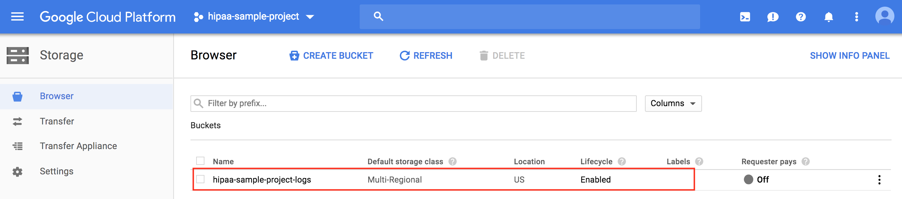

2) Lifecycle is enabled for the log bucket. Viewing the lifecycle policies, reveals a delete action for objects older than the value specified by `LOGS_TTL` parameter.

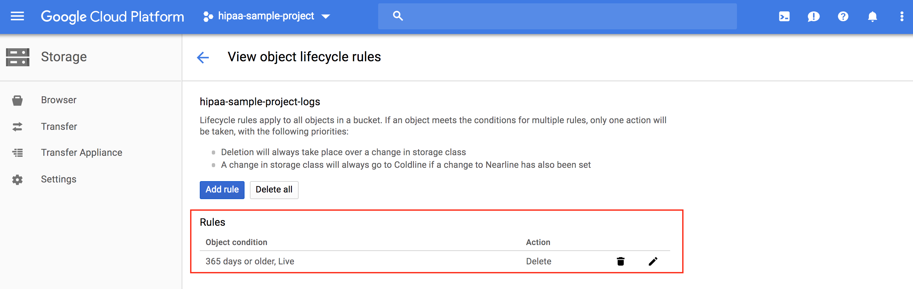

3) There are four permissions against the bucket; among them `cloud-storage-analytics@google.com`.
Refer to [this link](https://cloud.google.com/storage/docs/access-logs#delivery) to understand why `cloud-storage-analytics@google.com` must have write access to the bucket.
The rest of the permissions match the "log bucket" column in the [group roles table](#defined-groups).

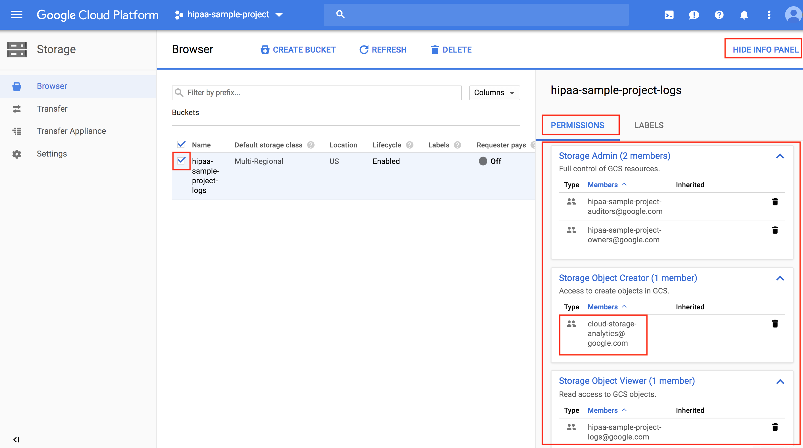

### Step 4: Set up the main Cloud Storage bucket
By running `create_data_bucket()` function, you:
 - create the main Cloud Storage data bucket
 - enable logging and versioning for the bucket
 - set/overwrite access rights according to [best practices](#best-practices)

##### Executed commands
```
gsutil mb -p [PROJECT_ID] -c [DATA_STORAGE_CLASS] -l [DATA_BUCKET_LOCATION] gs://[DATA_BUCKET_ID]

gsutil logging set on -b gs://[LOGS_BUCKET_ID] gs://[DATA_BUCKET_ID]

gsutil versioning set on gs://[DATA_BUCKET_ID]

gsutil iam set [JSON_FILE] gs://[DATA_BUCKET_ID]

```

##### Expected result(s)
1) [Storage browser](http://console.cloud.google.com/storage/browser) shows the newly created bucket for storing the data. Bucket name, storage class and location are according to `parameters.py`.

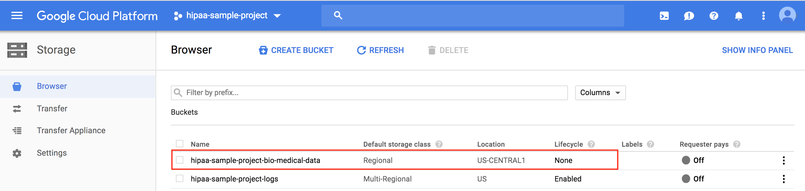

2) Objects in the data bucket are [versioned](https://cloud.google.com/storage/docs/object-versioning). You can issue the following command to verify:

```
gsutil versioning get gs://[BUCKET_NAME]

```

3) Capturing [access and storage logs](https://cloud.google.com/storage/docs/access-logs) for the bucket has commenced. Logs are stored in the log bucket that was set up in the previous step. You can issue the following command to verify:

```
gsutil logging get gs://[BUCKET_NAME]

```

There are three permissions against the bucket. Permissions match the "data bucket" column in the [group roles table](#defined-groups).

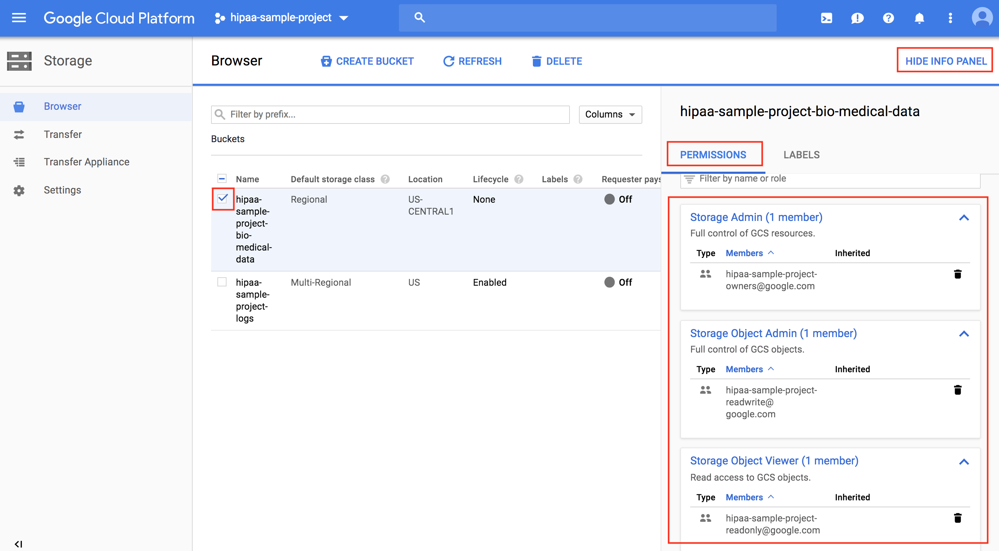


### Step 5: Set up audit logging and monitoring
By running `enable_audit_monitoring()` function, you:
 - turn on audit logging for all GCP services
 - set up a stream of log exports to BigQuery
 - define alerts that fire off when [offensive activities](#offensive-activities) are detected among audit logs
 - define a query that extracts the history of [offensive activities](#offensive-activities) from BigQuery

##### Executed commands

This step executes quite a number of commands; below is the list of commands in the order of execution:
```
gcloud projects set-iam-policy [PROJECT_ID] [JSON_FILE]

gcloud services enable bigquery --project [PROJECT_ID]

bq mk --data_location [LOGS_LOCATION] --description [DESC] [LOGS_SINK_DATASET_ID]

gcloud logging sinks create [LOGS_SINK_NAME] [LOGS_SINK_DESTINATION] --project [PROJECT_ID] --log-filter='resource.type="*"'

bq update --source=[JSON_FILE] [LOGS_SINK_DATASET_ID]

gcloud logging metrics create [METRIC_NAME]  --description=[DESC]  --project=[PROJECT_ID] --log-filter=[LOG_FILTER]

gcloud alpha monitoring channels create --channel-content-from-file [JSON_FILE]

gcloud alpha monitoring policies create --policy-from-file [JSON_FILE]

bq query --use_legacy_sql=false [SQL_FILE]
```

##### Expected result(s)
1) [Admin Console](http://console.cloud.google.com/iam-admin/audit/allservices) shows [data access logs](https://cloud.google.com/logging/docs/audit/configure-data-access) turned on for all services.

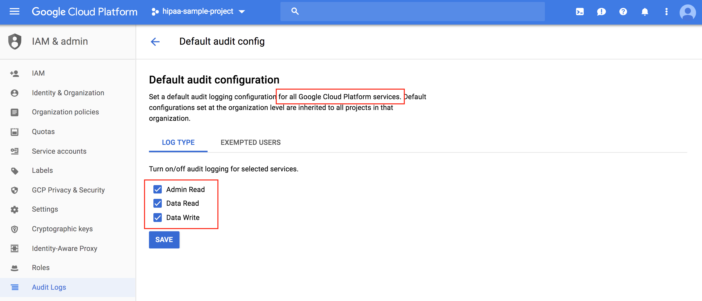

2) [API console](http://console.cloud.google.com/apis/api/bigquery-json.googleapis.com/overview) shows BigQuery API enabled.

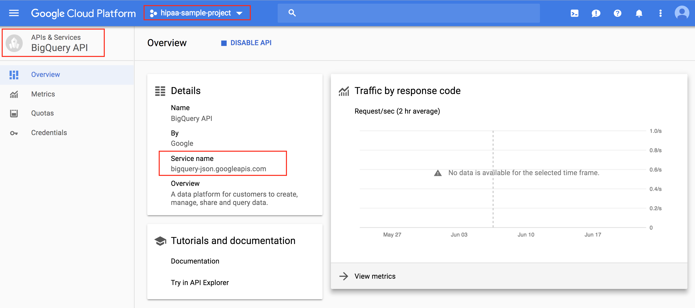

3) [BigQuery web console](http://console.cloud.google.com/bigquery) shows a new dataset. Dataset ID, Data location and Description is according to `LOGS_LOCATION` and `LOGS_SINK_DATASET_ID` parameters.

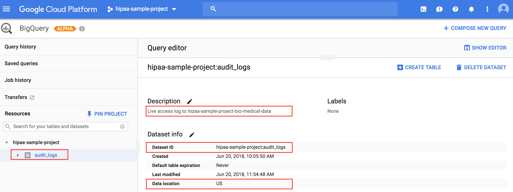

4) [Logging  Console](http://console.cloud.google.com/logs/exports) shows a new export sink.

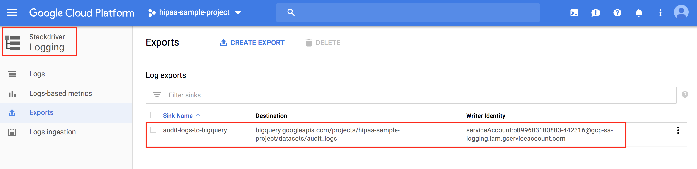

5) Aside from the [defined group permissions](#defined-groups), the service account that streams Stackdriver logs into BiqQuery is also given edit rights to the dataset.
</br>
>:point_right: **Note**: At the time of this writing, the new User Interface (UI) for BigQuery is in alpha and does not yet allow viewing Dataset permissions. The screen capture below shows [BigQuery's classic UI](https://bigquery.cloud.google.com/).
</br>

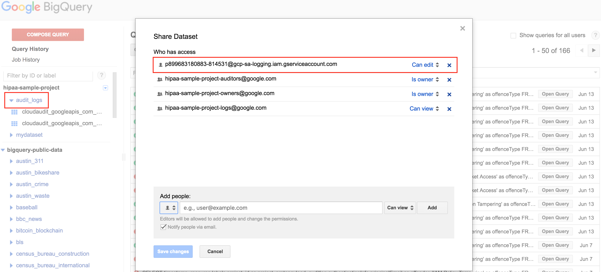

6) [Logging  Console](http://console.cloud.google.com/logs/exports) shows three log-based metrics, each counting one type of [offense](#offensive-activities) among the audit logs.

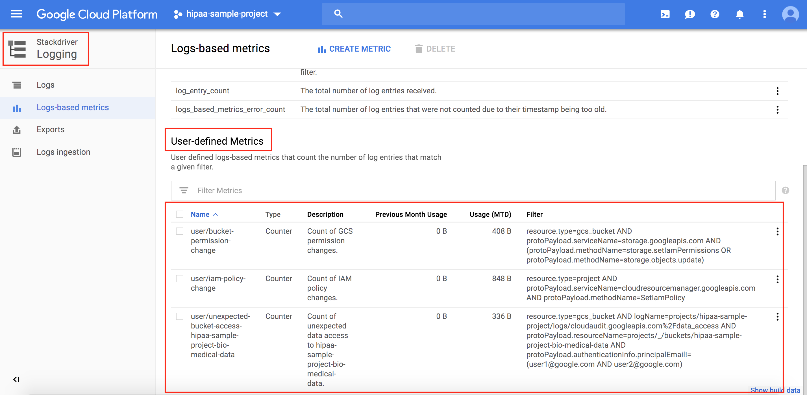

7) [Stackdriver Alerting console](https://app.google.stackdriver.com/policy-advanced) shows three alerting policies that fire off based on the corresponding log-based metric.

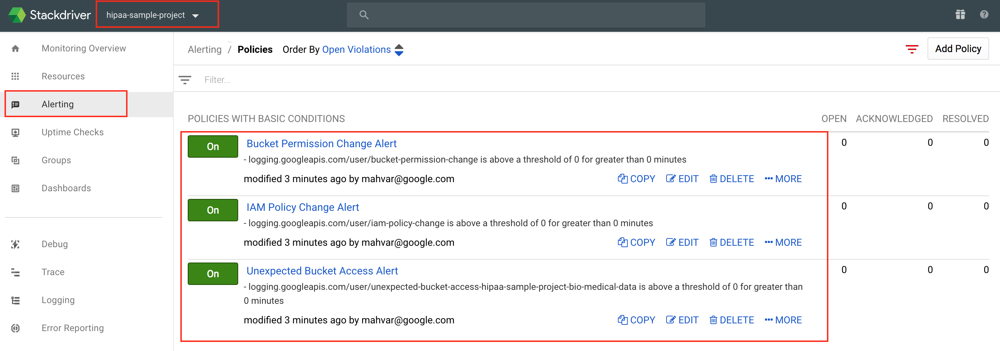

8) The script composes a query against the logs streaming into BigQuery. The query organizes log history according to [offense type](#offensive-activities) in chronological order. The complete query is displayed below.
This is meant as a starting point; use it as a reference for queries that you need to write in response to your requirements. As a next step, you could use [DataStudio](https://cloud.google.com/data-studio/) and build visual dashboards based on this data.
</br>
>:point_right: **Note**: There is a noticeable lag between the time the log export is created and when the data starts streaming into the BQ dataset. If the query fails with errors suggesting absence of the tables or empty tables, try again later.
</br>

```sql
SELECT timestamp, resource.labels.project_id as project, protopayload_auditlog.authenticationInfo.principalEmail as offender,'IAM Policy Tampering' as offenceType
FROM `my-sample-locked-down-project.cloudlogs.cloudaudit_googleapis_com_activity_*`
WHERE resource.type = "project" AND protopayload_auditlog.serviceName = "cloudresourcemanager.googleapis.com"
      AND protopayload_auditlog.methodName = "SetIamPolicy"

UNION DISTINCT

SELECT timestamp, resource.labels.project_id as project, protopayload_auditlog.authenticationInfo.principalEmail as offender,'Bucket Permission Tampering' as offenceType
FROM `my-sample-locked-down-project.cloudlogs.cloudaudit_googleapis_com_activity_*`
WHERE resource.type = "gcs_bucket"
      AND protopayload_auditlog.serviceName = "storage.googleapis.com"
      AND(protopayload_auditlog.methodName = "storage.setIamPermissions" OR protopayload_auditlog.methodName = "storage.objects.update")

UNION DISTINCT

SELECT timestamp, resource.labels.project_id as project, protoPayload_auditlog.authenticationInfo.principalEmail as offender, 'Unexpected Bucket Access' as offenceType
FROM `my-sample-locked-down-project.cloudlogs.cloudaudit_googleapis_com_data_access_*`
WHERE resource.type = 'gcs_bucket'
      AND (protoPayload_auditlog.resourceName LIKE '%my-sample-locked-down-project-logs' OR protoPayload_auditlog.resourceName LIKE '%my-sample-locked-down-project-bio-medical-data')
      AND protoPayload_auditlog.authenticationInfo.principalEmail NOT IN('user1@google.com','user2@google.com')

ORDER BY timestamp DESC
```

The script wraps up by displaying the query results on the console. Below, is a mock example.

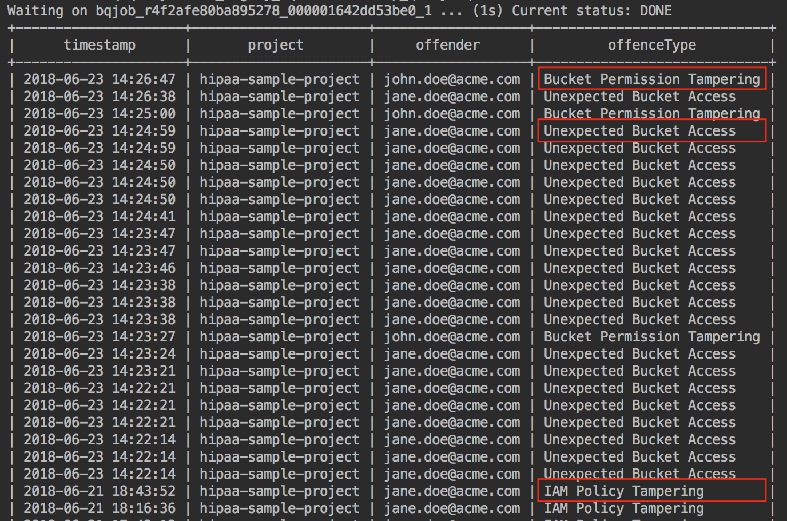

### THE END

## License Copyright 2018 Google Inc. All Rights Reserved.

Licensed under the Apache License, Version 2.0 (the “License”); you may not use this file except in compliance with the License. You may obtain a copy of the License at http://www.apache.org/licenses/LICENSE-2.0 Unless required by applicable law or agreed to in writing, software distributed under the License is distributed on an “AS-IS” BASIS, WITHOUT WARRANTIES OR CONDITIONS OF ANY KIND, either express or implied. See the License for the specific language governing permissions and limitations under the License.
