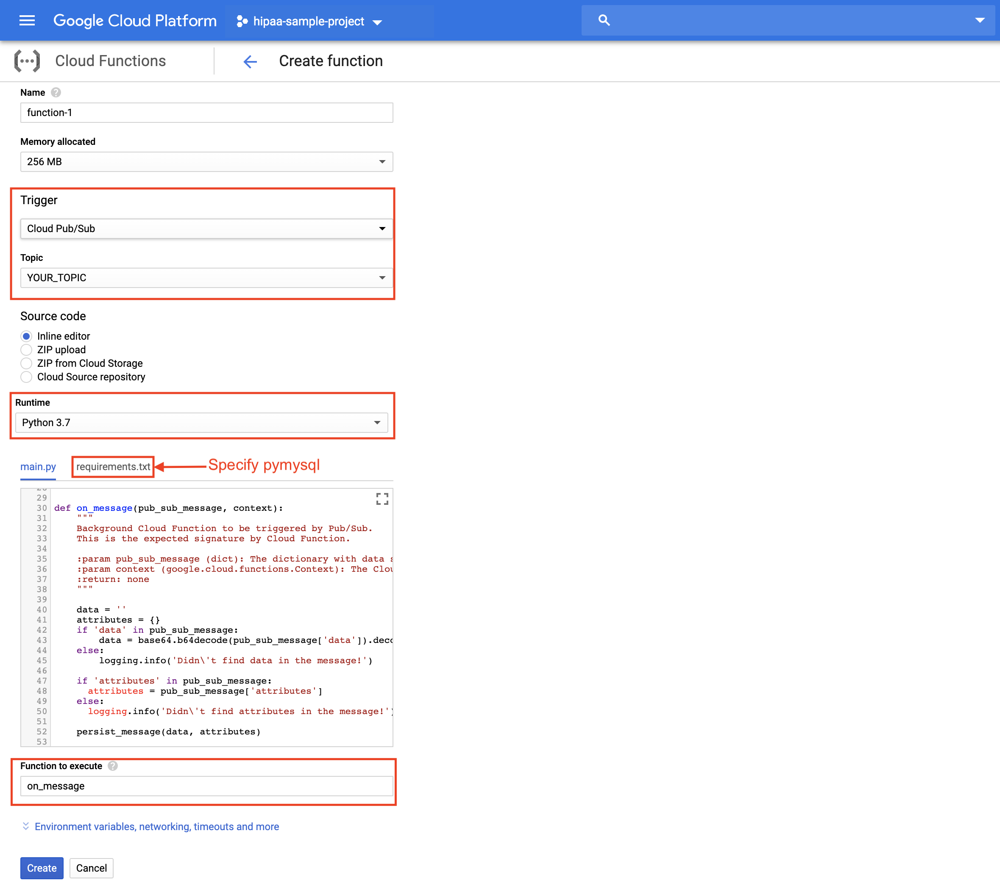

# Persist Pub/Sub messages in Cloud SQL

On a few different occasions, I’ve used [Cloud Functions](https://cloud.google.com/functions) to persist [Pub/Sub](https://cloud.google.com/pubsub) messages in [Cloud SQL](https://cloud.google.com/sql) tables for later analysis. While I won't be able to share the bigger architecture, I believe this miniature solution is a useful little thing by itself. 

Assuming you already have an architecture that relies on [Cloud Pub/Sub topics](https://cloud.google.com/pubsub/docs/overview), this tutorial walks you through the process of creating a Cloud Function as a topic subscriber and a Cloud SQL table where the subscriber somewhat blindly persists the messages. The function could [de-dupe the messages](#deduping-messages), if you give it a message attribute to use as a uniqueness handle. 


## Before you start

1. If you're using your local environment for command line interface (CLI), make sure you have installed [Google Cloud SDK](https://cloud.google.com/sdk/install). Alternatively, you could use [Cloud Shell](https://cloud.google.com/shell/).

2. If you haven't done so already, authenticate with Google Cloud and set the current [project](https://cloud.google.com/storage/docs/projects):
    
	```
    gcloud init
	```
 
3. Enable Cloud Functions API by visiting [the API library console](https://pantheon.corp.google.com/apis/library/cloudfunctions.googleapis.com?q=cloud%20fun&id=2174da14-0e34-49ed-9267-e258674e95da&project=powerful-rhino-209018&folder&organizationId&supportedpurview=project). 
 
4. Follow [the quick start tutorial for Cloud SQL](https://cloud.google.com/sql/docs/mysql/quickstart) to create a second generation MySQL instance and a database.

5. Create the destination table in your Cloud SQL database. There's a minimal schema required: 
   
   ```
   CREATE TABLE YOUR_TABLE_NAME (
       time TIMESTAMP, 
       data varchar(255),
       attributes varchar(255)
   );
   ```

6. Scan ```main.py``` for ```CHANGE ME``` comments and replace the placeholders with actual values.


## Deploying the function

You can deploy the function through CLI: 

```
gcloud functions deploy on_message --runtime python37 --trigger-topic YOUR_TOPIC_NAME
```

Or interactively via [Cloud Console](https://console.cloud.google.com): 



## Testing the function

1. Trigger the function by publishing a message to your Pub/Sub topic:

   ```
   gcloud pubsub topics publish YOUR_TOPIC_NAME --message=YOUR_MESSAGE --attribute=YOUR_ATTRIBUTE
   ```

   Alternatively, you could publish messages interactively on [Pub/Sub console](https://console.cloud.google.com/cloudpubsub/topic):

   

2. Check the logs to be sure the execution has completed:

   ```
   gcloud functions logs read --limit 50
   ```

3. Query the SQL table to see the message persisted:

   ```
   gcloud sql connect YOUR_INSTANCE --user=YOUR_USER
   ``` 

   ````
   USE YOUR_DATABASE;
   ````

   ````
   SELECT * FROM YOUR_TABLE LIMIT 10;
   ````

## Deduping messages
If Pub/Sub messages have accompanying attributes, you can declare one attribute key as ```HANDLE_ATTRIBUTE_KEY```, defined in ```main.py```, and the function will ensure only the latest instance of messages with any given value for that attribute key is present in the database. For example, if you set ```HANDLE_ATTRIBUTE_KEY='Greeting'``` and message1 arrives with attribute ```{key:'Greeting', value:'Hello'}```, it'll be persisted, because there are no other earlier messages with Greeting as Hello. When message2 arrives with attribute ```{key:'Greeting', value:'Hello'}```, it will replace message1, ensuring there is only one message with Greeting as Hello. When message3 arrives with attribute ```{key:'Greeting', value:'Howdy'}```, it'll be added to the database without touching message2. At that point the database would have one message for Hello and another for Howdy. It's a case sensitive comparison, though. 'Hello' and 'hello' are considered two different Greetings.

## Disclaimer

- This is not an official Google product.
- Cloud Functions, Cloud Pub/sub and Cloud SQL are billable services. While many experiments end up costing nothing under Google Cloud [free tier](https://cloud.google.com/free/), you should always consult [the price calculator](https://cloud.google.com/products/calculator/) beforehand to understand any potential costs.   


### THE END

## License Copyright 2019 Google Inc. All Rights Reserved.

Licensed under the Apache License, Version 2.0 (the “License”); you may not use this file except in compliance with the License. You may obtain a copy of the License at http://www.apache.org/licenses/LICENSE-2.0 Unless required by applicable law or agreed to in writing, software distributed under the License is distributed on an “AS-IS” BASIS, WITHOUT WARRANTIES OR CONDITIONS OF ANY KIND, either express or implied. See the License for the specific language governing permissions and limitations under the License.