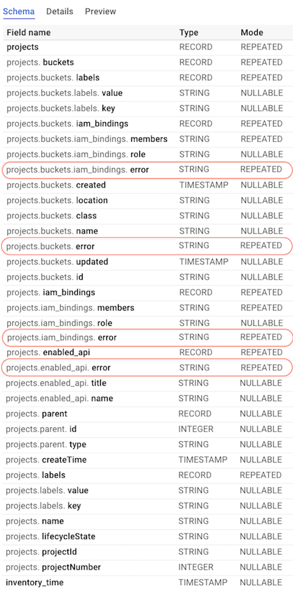
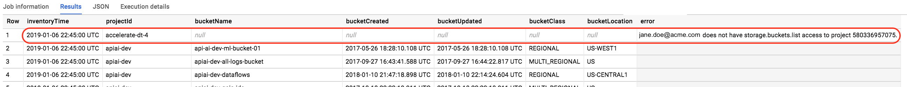

# Auto inventory your projects and storage buckets

If you are like me and work with various teams doing different things in [Google Cloud](https://cloud.google.com), you tend to accumulate access rights to [projects](https://cloud.google.com/docs/overview/#projects) and, among all resource types, [Cloud Storage buckets](https://cloud.google.com/storage/docs/key-terms#buckets).
You may even be the person who spins off projects and buckets for others to use. In any case, if you ever find yourself scratching your head about some of the following questions, you may find this utility useful:


- What projects do I have access to? Hereinafter referred to as __"my projects"__.
- What type of access do I have against "my projects"?
- Who else has what rights against "my projects"?
- What APIs are enabled in "my projects"?
- What storage buckets exists across "my projects"? Hereinafter referred to as __"my buckets"__.
- What type of access do I have against "my buckets"?
- Who else has what rights against "my buckets"?
- And other questions of this nature...

## Before you start
1. If you are not a Google internal user, ensure you have enabled the Cloud Resource Manager API via [API console](https://console.developers.google.com/apis/api/cloudresourcemanager).
2. This script uses [Application Default Credentials](https://cloud.google.com/sdk/gcloud/reference/auth/application-default/) for authentication.
   If not already done, [install the gcloud sdk](https://cloud.google.com/sdk) and run:
    ```
   gcloud auth application-default login
    ```
3. If you are using [Conda](https://conda.io/docs/) to manage your python environments, use requirements.txt to create an environment with all the required packages:
    ```
    conda create --name <env> --file requirements.txt
    ```
4. Otherwise, [install python 3](https://realpython.com/installing-python/) and the following requirements:
    ```
    pip install google-api-python-client
    pip install oauth2client
    pip install google-cloud-bigquery
    ```
5. Target a [BigQuery dataset](https://cloud.google.com/bigquery/docs/datasets-intro#datasets) where your account has rights to create a table.


## Running the script

```
python resource_inventory.py [project filter] [BigQuery dataset Id] [BigQuery table Id]
```

__[project filter]__: Wildcard string to specify which projects to inventory. For example, to inventory projects with names starting with PROD, you'd pass __name:PROD*__ as project filter.

__[BigQuery dataset Id]__: The Id for an existing BiqQuery dataset. The authenticated user must have rights to create/update tables in that dataset.

__[BigQuery table Id]__: The Id for the table in the specified dataset where the inventory is persisted to. If the table doesn't exist, it will be created. Otherwise, new inventory is appended to previous records.
If appending to an existing table, it has to have the same schema as current inventory record.

## Using the inventory

The inventory data is stored in BigQuery. Each time you run the script, a single row with [nested and repeated columns](https://cloud.google.com/bigquery/docs/nested-repeated) is added to the BigQuery table that you specify via parameters.
BigQuery detects table schema, shown below, from the JSON object that our script creates on the fly. You may not see the error fields highlighted in red; refer to [errors and warnings section](#understanding-errors-and-warnings) for more details.



In order to extract meaningful insights, you need to use [BigQuery Web UI](http://console.cloud.google.com/bigquery) to issue SQL queries against the inventory table. Below, are a few examples to get you started:

```sql
# list buckets across projects in the latest inventory
# replace placeholders enclosed in brackets before using

SELECT t.inventory_time as inventoryTime, p.projectId, b.name as bucketName,
b.created as bucketCreated, b.updated as bucketUpdated, b.class as bucketClass,
b.location as bucketLocation

FROM `[project Id].[dataset Id].[table Id]` t,
UNNEST(t.projects) as p, UNNEST (p.buckets) as b

WHERE inventory_time = (SELECT MAX(inventory_time) FROM `[project Id].[dataset Id].[table Id]`)

ORDER By inventoryTime DESC, p.projectId ASC, bucketName ASC
```

```sql
# Get growth of bucket count over time in a specific project
# replace placeholders enclosed in brackets before using

SELECT t.inventory_time as inventoryTime, COUNT(b.name) as bucketCount

FROM `[project Id].[dataset Id].[table Id]` t,
UNNEST(t.projects) as p, UNNEST (p.buckets) as b

WHERE p.projectId = "[project Id]"

GROUP BY inventoryTime
ORDER BY inventoryTime ASC
```

```sql
# list buckets and their access policies across projects in the latest inventory
# replace placeholders enclosed in brackets before using

SELECT t.inventory_time as inventoryTime, p.projectId, b.name as bucketName,
b.iam_bindings as bucket_iam_bindings

FROM `[project Id].[dataset Id].[table Id]` t,
UNNEST(t.projects) as p, UNNEST (p.buckets) as b

WHERE inventory_time = (SELECT MAX(inventory_time) FROM `[project Id].[dataset Id].[table Id]`)

ORDER By inventoryTime DESC, p.projectId ASC, bucketName ASC
```

```sql
# list all the project level access polices in the latest inventory
# replace placeholders enclosed in brackets before using

SELECT t.inventory_time as inventoryTime, p.projectId, p.iam_bindings

FROM `[project Id].[dataset Id].[table Id]` t,
UNNEST(t.projects) as p

WHERE inventory_time = (SELECT MAX(inventory_time) FROM `[project Id].[dataset Id].[table Id]`)

ORDER By inventoryTime DESC, p.projectId ASC
```

```sql
# list all the project level roles for a certain user in the latest inventory
# replace placeholders enclosed in brackets before using

SELECT t.inventory_time as inventoryTime, p.projectId, pb.role as role

FROM `[project Id].[dataset Id].[table Id]` t,
UNNEST(t.projects) as p, UNNEST (p.iam_bindings) as pb

WHERE inventory_time = (SELECT MAX(inventory_time) FROM `[project Id].[dataset Id].[table Id]`)
AND "user:[john.doe@acme.com]" IN UNNEST (pb.members)

ORDER By inventoryTime DESC, p.projectId ASC
```

## Understanding errors and warnings

:warning: When running the script, you'll receive the following warning, which you can safely ignore!
Remember, we are interested in the inventory of resources from an end user's point of view, your point of view, not a [service account](https://cloud.google.com/iam/docs/understanding-service-accounts).

    ```
    Ignore this warning!

    Your application has authenticated using end user credentials from Google Cloud SDK.
    We recommend that most server applications use service accounts instead.
    If your application continues to use end user credentials
    from Cloud SDK, you might receive a "quota exceeded" or "API not enabled" error.
    For more information about service accounts,
    see https://cloud.google.com/docs/authentication/ warnings.warn(_CLOUD_SDK_CREDENTIALS_WARNING)
    ```


:x: Note that you don't always have the rights to make all the required API calls, i.e: query list of buckets in a project, query list of enabled APIs in a project,
query list of Identity and Access Management (IAM)  policies in a project, etc. In such cases, you'll notice an error field instead of the expected metadata as shown in the following image; don't be alarmed.

   


:x: If you persist inventory data to an existing table from a previous run, you could sometimes face schema errors.
You should either delete the existing table or name a non-existing table and rerun the script. Common causes for this situation are as follows:
- In the previous run, there were no errors. Therefore, the table schema doesn't recognize error field. Beware that error field can show up at different levels of the object hierarchy.
- In the previous run, there were no project labels. Therefore, the table schema doesn't recognize project.lables field.
- In the previous run, there were no bucket labels. Therefore, the table schema doesn't recognize buckets.lables field.

## Disclaimer

- This is not an official Google product.
- :point_right: This utility uses BigQuery, which is a billable service. If you take care of deleting unused
data and querying only the required columns,
chances are you'll remain within the [free tier](https://cloud.google.com/free/). However, the onus is on you to understand
[the pricing model](https://cloud.google.com/bigquery/pricing) and be conscious of the costs.
- This utility only extracts metadata about projects and storage buckets; it doesn't support other resource types.
- The inventory data is in the form of a SINGLE hierarchical object definition (think JSON). Each time you run the script,
a single row with the schema shown [earlier](#using-the-inventory) is added to the BigQuery table.
- In order to extract meaningful insights, you need to use BigQuery Web UI to issue SQL queries against the inventory table.
There are a few sample queries in the section [using the inventory](#using-the-inventory) to get you started,
but if this is the first time you are dealing with arrays in SQL, you may need to consult
[BigQuery documentation](https://cloud.google.com/bigquery/docs/reference/standard-sql/arrays).
- For a more wholistic view into all resource types and more user friendly interface, you should look into
[Google Cloud Asset Inventory](https://cloud.google.com/security-command-center/docs/how-to-asset-inventory).


### THE END

## License Copyright 2019 Google Inc. All Rights Reserved.

Licensed under the Apache License, Version 2.0 (the “License”); you may not use this file except in compliance with the License. You may obtain a copy of the License at http://www.apache.org/licenses/LICENSE-2.0 Unless required by applicable law or agreed to in writing, software distributed under the License is distributed on an “AS-IS” BASIS, WITHOUT WARRANTIES OR CONDITIONS OF ANY KIND, either express or implied. See the License for the specific language governing permissions and limitations under the License.
